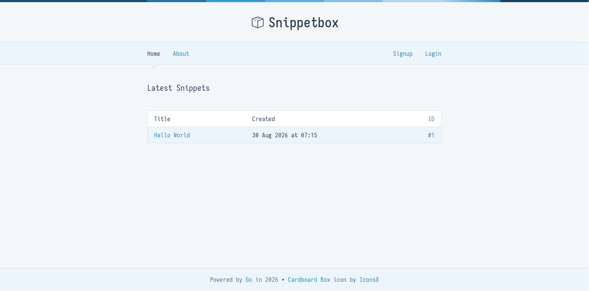

# Snippetbox

A secure web application for code snippet sharing and management, built with Go and PostgreSQL.

## Features

- Secure user authentication and session management
- Code snippet creation and management with expiration dates
- Minimal, responsive UI built with type-safe templates
- Seamless containerization with Docker and Docker Compose

## Preview



## Tech Stack

**Backend**
- Go 1.26
- PostgreSQL 16
- [pgx/v5](https://github.com/jackc/pgx) (PostgreSQL driver)
- [sqlx](https://github.com/vinovest/sqlx) (database extensions)
- [scs/v2](https://github.com/vinovest/sqlx) (session management)
- [nosurf](https://github.com/justinas/nosurf) (CSRF protection)
- bcrypt (password hashing)
- [alice](https://github.com/justinas/alice) (middleware chaining)

**Frontend**
- [templ](https://github.com/a-h/templ) (type-safe templates)
- Vanilla CSS

**DevOps**
- Docker & Docker Compose
- Multi-stage builds

## Project Structure

```
snippetbox/
├── cmd/web/          # Application entry point
├── internal/
│   ├── models/       # Data models and database operations
│   └── sql/          # Database schema
├── ui/
│   ├── html/         # Templates
│   └── static/       # CSS and JS
├── docker-compose.yaml
├── Dockerfile
└── Justfile
```

## Getting Started

### Docker (Recommended)

1. Generate TLS certificates:
```bash
openssl req -x509 -newkey rsa:4096 -keyout tls/key.pem -out tls/cert.pem -days 365 -nodes -subj "/CN=localhost"
```

2. Start services:
```bash
docker-compose up -d
```

3. Access at https://localhost:4000

### Local Development

1. Install dependencies:
```bash
go mod download
go install github.com/a-h/templ/cmd/templ@v0.3.1001
```

2. Set up PostgreSQL database and run migrations from `internal/sql/postgres.sql`

3. Generate templates:
```bash
templ generate ./ui/...
```

4. Run:
```bash
go run ./cmd/web
```

## Demo Credentials

- Email: demo@example.com
- Password: demo

## Configuration

Environment variables:
- `ADDR`: Server address (default: `:4000`)
- `DSN`: Database connection string
- `DEBUG`: Enable debug mode (default: `false`)
- `TLS_CERT`: TLS certificate path
- `TLS_KEY`: TLS private key path

## Development Commands

```bash
just generate    # Generate templates
just dev         # Live reload development
just build       # Build production binary
just clean       # Clean artifacts
just watch-test  # Run tests with file watching
```

## Testing

```bash
go test -v -cover ./...
```

## Security

- Authentication & Sessions: BCrypt password hashing (cost factor 12) paired
  with PostgreSQL-backed secure session tokens.
- Data Protection: Parameterized queries preventing SQL injection alongside
  rigorous input validation and sanitization
- Request Integrity: Built-in CSRF protection enforced across all
  state-changing operations
